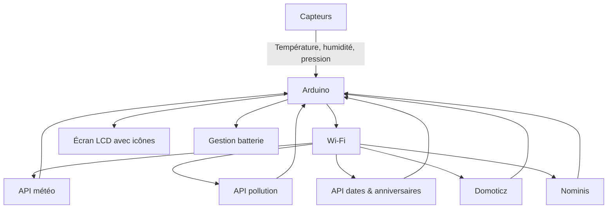
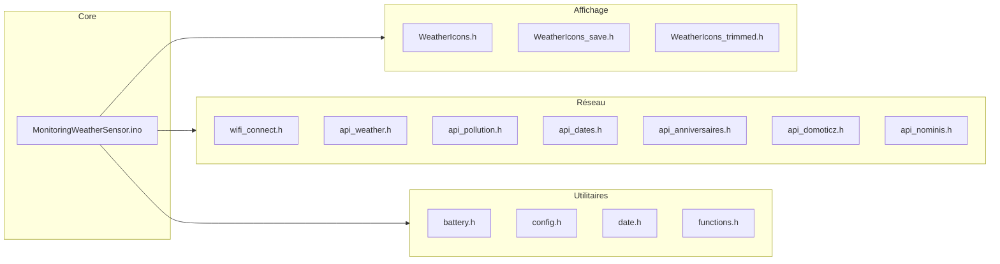

# MonitoringWeatherSensor

Un projet Arduino pour surveiller et afficher des informations météorologiques à partir de capteurs et d'API externes.  
Le système inclut la gestion de la batterie, la connexion Wi-Fi et des icônes météo personnalisées pour l'affichage.

---

## 🛠️ Fonctionnalités

- 📡 Lecture des capteurs météo (température, humidité, pression, etc.).
- 🌍 Connexion à Internet via Wi-Fi.
- 🔌 Intégration de plusieurs API externes :
  - Météo
  - Pollution de l’air
  - Dates et anniversaires
  - Domoticz
  - Nominis
- 🖼️ Affichage d’icônes météo personnalisées.
- 🔋 Gestion de la batterie et de l’alimentation.

---

## 📊 Schéma de fonctionnement



---

## 🧩 Diagramme des modules



---

## 📁 Structure du projet

| Fichier | Description |
|---------|------------|
| `MonitoringWeatherSensor.ino` | Fichier principal du projet Arduino. |
| `WeatherIcons*.h` | Bibliothèques d’icônes météo pour l’affichage. |
| `api_*.h` | Gestion des appels aux différentes API externes. |
| `battery.h` | Gestion de la batterie et de l’alimentation. |
| `wifi_connect.h` | Gestion de la connexion Wi-Fi. |
| `config.h` | Paramètres de configuration du projet. |
| `date.h` | Gestion des dates et calendrier. |
| `functions.h` | Fonctions auxiliaires diverses. |

---

## ⚙️ Installation

1. Installer [Arduino IDE](https://www.arduino.cc/en/software) ou [PlatformIO](https://platformio.org/).
2. Cloner le dépôt :
   ```bash
   git clone https://github.com/babasss/MonitoringWeatherSensor.git
   ```
3. Installer les bibliothèques Arduino nécessaires :
   - LiquidCrystal
   - WiFi
   - ArduinoJson
   - Autres dépendances selon vos capteurs
4. Configurer `config.h` avec vos paramètres Wi-Fi et API.
5. Ouvrir `MonitoringWeatherSensor.ino` dans l’IDE et téléverser sur votre carte Arduino.

---

## 🚀 Utilisation

1. Allumer l’Arduino et vérifier que la connexion Wi-Fi est établie.
2. Les données météo et autres informations s’affichent sur l’écran LCD.
3. Les icônes météo s’affichent dynamiquement en fonction des conditions actuelles.

---

## ⚠️ Points d’amélioration

- 📝 Ajouter des commentaires détaillés dans le code pour faciliter la maintenance.
- 🛡️ Gérer les erreurs de connexion et d’API pour plus de robustesse.
- 🧪 Ajouter des tests unitaires avec [ArduinoUnit](https://github.com/mmurdoch/arduinounit).
- ⚡ Optimiser la consommation d’énergie pour les dispositifs alimentés par batterie.
- 🔧 Prévoir un mode "hors ligne" en cas de perte Wi-Fi.

---

## 📄 Licence

À définir (par exemple **MIT License**).

---

## 🤝 Contributions

Les contributions sont les bienvenues !  
Merci de proposer vos améliorations via des **issues** ou **pull requests**.

---
